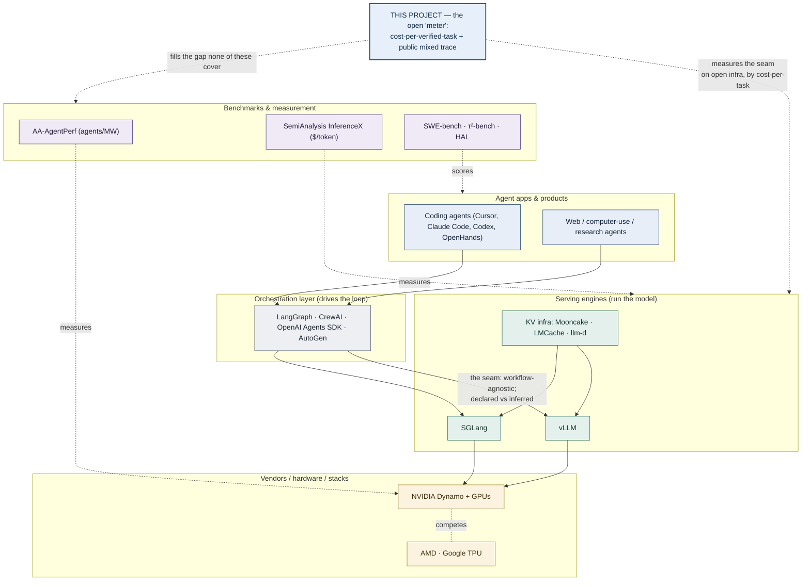
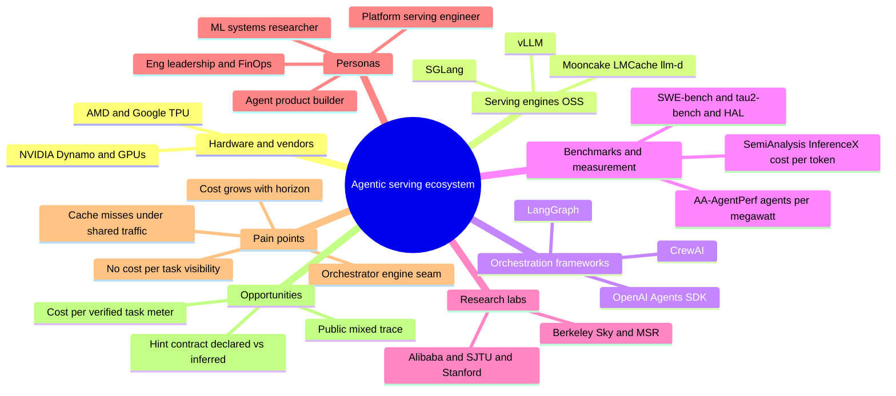

# Agentic-Serving — Ecosystem & Product Map

*The **product / business lens** that the measurement paper sits inside — ecosystem players, personas,
journeys, pains, and opportunities. This is a **companion**, not part of the paper's scientific claims
(the paper is the open measurement; this map is the market/product view, useful for the NVIDIA-product
/ customer-discovery side). Diagrams are Mermaid (renders on GitHub); see the format note at the bottom
for richer/interactive options.*

---

## 1. Ecosystem — the relational map (who builds on / competes with / measures whom)

**The takeaway the map encodes:** value flows top-down (apps → orchestration → engines → hardware); the
**seam** (orchestration ↔ engine) is where reuse is lost; everyone is piling into *mechanisms* (engines,
Dynamo, KV infra) and *vendor benchmarks* (AA-AgentPerf, InferenceX) — but **no one occupies the open,
cost-per-completed-task measurement of the seam.** That's where this project sits.

## 2. Bird's-eye mindmap

## 3. Personas

| Persona | Who they are | Goal | What they care about | Pain today |
|---|---|---|---|---|
| **Platform / serving engineer** | infra team at an AI-infra co or a Dynamo customer | serve agents cheaply at the SLO | goodput, $/GPU-hour, cache hit rate | can't explain *why* agents cost ~5× chat; co-locating chat+agents spikes cost and they can't see why |
| **Agent product builder / startup** | building a coding or workflow agent | viable unit economics | cost per *completed* task, latency, margins | cost blows up at long horizons; $/token looks fine but $/task explodes; no visibility into where it goes |
| **ML-systems researcher** | serving / KV-cache research | publish, compare fairly | reproducibility, a standard metric, a public trace | no public agentic+cost-labeled trace; can't compare engines/configs apples-to-apples |
| **Eng leadership / FinOps** | owns the inference budget | forecast & control spend | $/outcome, predictability | unpredictable token bills; no "cost per successful task" meter to budget against |
| **Inference-vendor PM** *(the internship's customer lens)* | NVIDIA / a serving vendor | make the stack the best for agents | which agentic pains are biggest & most monetizable | doesn't have an open, neutral measurement of where the cost actually goes |

## 4. User journeys (pain in motion)

1. **The surprise bill** *(agent startup)* — usage scales; the token bill 4×s. Per-token price is unchanged, but **cost per completed task exploded at long horizons** and no tool shows why. → *needs the cost-of-grit meter.*
2. **The platform team's blind spot** *(infra eng)* — they co-locate chat + agents to save GPUs; agent latency/cost spikes; they *suspect* cache eviction but the engine only exposes an **aggregate** hit rate, not "did chat evict *this agent's* cache." → *needs per-tenant attribution + the locality-gap metric.*
3. **The apples-to-oranges comparison** *(researcher)* — wants vLLM vs. SGLang for agents; there's **no public mixed trace** and **no standard cost-per-task metric**, so every paper measures differently. → *needs the open trace + the metric standard.*

## 5. Pain → Opportunity map

| Pain (market) | Opportunity | Who captures it | This project? |
|---|---|---|---|
| Cost grows super-linearly with horizon, hidden by $/token | **The "meter": cost-per-verified-task** (the locality-tax curve) | researchers + FinOps + vendors | ✅ **C1 (the paper)** |
| Cache reuse collapses under shared / bounded cache | quantify **realized-vs-available gap**; the *value of awareness* | serving teams | ✅ **C1 / H1** |
| No per-tenant cost/eviction visibility | **instrumentation + attribution methodology** | platform teams, vendor (Dynamo) | partial (paper measures; product builds) |
| Orchestrator↔engine seam (declared vs inferred) | a **hint contract / standard** | vendors (Dynamo), llm-d/Gateway | ⚠️ pre-empted (Dynamo); *measure its value* |
| No public agentic + cost-labeled trace | **release the trace** | the commons | ✅ **C3 (the artifact)** |
| Can't compare engines/configs fairly | reproducible **open-infra benchmark + metric** | the commons | ✅ bundled with C1/C3 |

**Where this project plays vs. the product side:** the **open measurement** (the meter + the trace, rows
marked ✅) is the *paper*. The **productized** versions — building the meter into Dynamo / a FinOps SaaS,
shipping the hint contract — are the *product/internship* side (the "C5" twin), deliberately out of the
paper's scope.

---

## Format note — best way to present this
- **In-repo, versioned, reviewable (what this file is):** Mermaid in Markdown — renders on GitHub, diffs
  cleanly, lives next to the work. Best for a map you'll iterate on with a co-author.
- **Mermaid `mindmap`** (section 2) = the brainstorm/taxonomy view; **Mermaid `flowchart`** (section 1) =
  the relational "who-relates-to-whom" view. Tables beat diagrams for personas/journeys/pains.
- **For a truly interactive / clickable / movable map** (workshop-style), a dedicated canvas —
  FigJam / Miro / Whimsical / Excalidraw — is better than Mermaid; export a PNG back here to version it.
- I can also generate a **self-contained interactive HTML** (zoomable nodes, hover details) on request.
